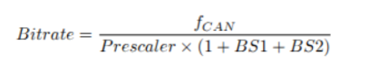
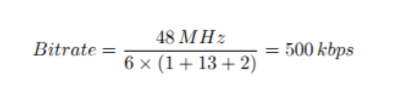
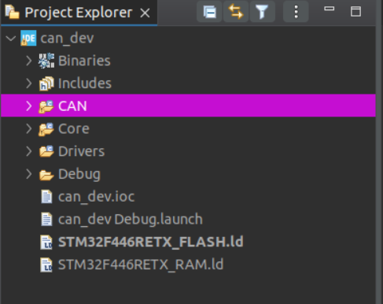
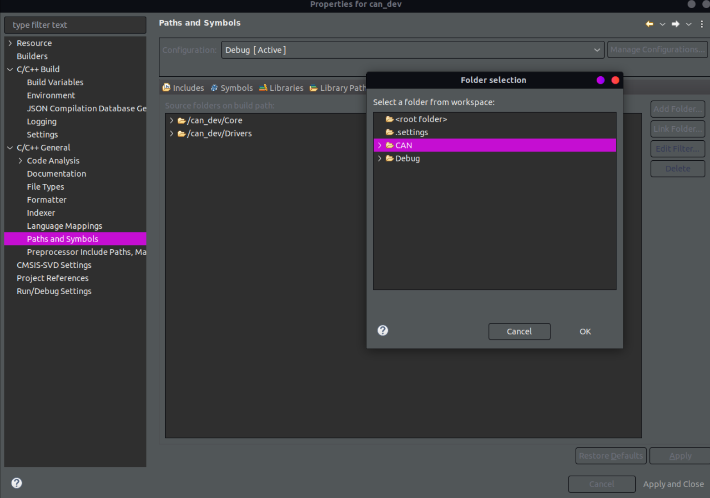

# What is CAN 

This document describes how to integrate **CAN (Controller Area Network)** into any of the STM32-based microcontroller nodes used in the LATCH system. These nodes act as distributed controllers for major subsystems such as actuation, sensing, power management, and diagnostics.

While the STM32 CAN peripheral is well documented, configuration details can be non-obvious when setting up a reliable multi-node network. The following blog post was a helpful reference during development:  
[Setting Up the CAN Bus on STM32](https://matthewtran.dev/2020/01/setting-up-the-can-bus-on-stm32)

However, this document is intended to be a **self-contained reference** specific to this project.

---

## Understanding CAN

Before diving into implementation details, it is important to understand the core concepts behind CAN.

**CAN (Controller Area Network)** is a robust, message-based communication protocol designed for distributed embedded systems. It uses a **multi-master architecture**, meaning there is no central master or slave device. Any node on the bus may transmit data when the bus is idle.

Instead of addressing messages to specific devices, CAN uses **message identifiers**. Each node decides which messages are relevant by filtering on these identifiers. This architecture makes CAN highly scalable and well-suited for fault-tolerant systems.

CAN also provides several hardware-level advantages:
- Differential signaling for noise immunity
- Automatic message arbitration
- Built-in error detection and handling
- Deterministic bus access

For a deeper protocol-level explanation, this video is a good resource:  
[CAN Bus Explained](https://www.youtube.com/watch?v=JZSCzRT9TTo)

Here is also a good write up on the lower-level deep dive into the CAN protocol:  
[Understanding the CAN Bus](https://www.wevolver.com/article/understanding-can-bus-a-comprehensive-guide)

---

# CAN Integration for STM32CubeMX

## Enable the CAN Communication Protocol

For the version of **STM32CubeIDE** we are using *(2.0.0)*, the **STM32CubeMX** tool is not built in, so we will need to open the **IOC** for our project and enable the **CAN1** interface under the communication tab. 

## Setting the Baud Rate

Once **CAN1** is enabled, the next step is configuring the CAN bit timing to achieve the desired baud rate. In **STM32CubeMX**, the CAN baud rate is **not set directly** as a single value; instead, it is derived from several timing parameters that divide the CAN peripheral clock.

Navigate to:

**CAN1 → Parameter Settings → Bit Timing Parameters**

### CAN Bit Timing Overview

For our LATCH we are looking to implement a 500MBs can bus. Below is an example of how to achieve this and the formula used.



Assuming a CAN peripheral clock of **48 MHz**:

- Prescaler = 6  
- BS1 = 13  
- BS2 = 2  



Once these parameters are set, save the IOC file and regenerate the project to apply the CAN configuration.


# Integrating CAN-API into Your STM32CubeIDE Project

Now that the IOC is setup, we need to add the custom CAN api written by your awesome lead that will help reduce the complexity of our can structure.

The first step is to copy the CAN folder where the *hpp* and *cpp* files live. You can download the zip containing the folder [here](https://drive.google.com/file/d/1Oi9-cgGh-wmnKVrizlkShOQthr1hAkUJ/view?usp=sharing).

After downloading this place the CAN folder in the parent directory of your STM32CubeMX project along side ```Core```, ```Drivers```, ```Debug```, and so on. Should look like the directory layout depicted below.



Next you need to add the *Src* and *Inc* directories to your build configurations to get everything to build. 

Navigate to:  
**Project → Properties → C/C++ Build → Settings → Include paths** and add ```../CAN/Inc```.


Then select apply and then if you are prompted, Rebuild Index as well.

Now navigate to:  
**Project → Properties → C/C++ General → Paths and Symbols → Source Location** and select ```add folder``` then select the ```CAN``` folder.



Now apply and close and you should be able to build and use the CAN API now!!


# CAN-API Usage

Now that everything is setup, here is how to use the custom CAN API for your stm device.

